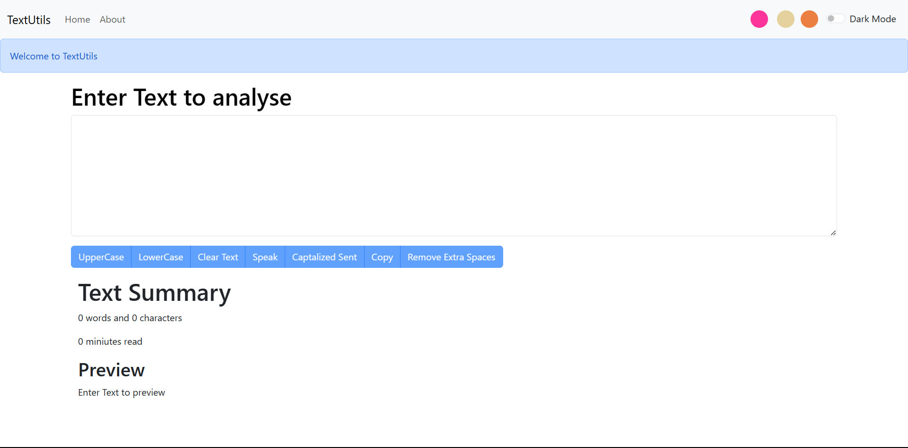
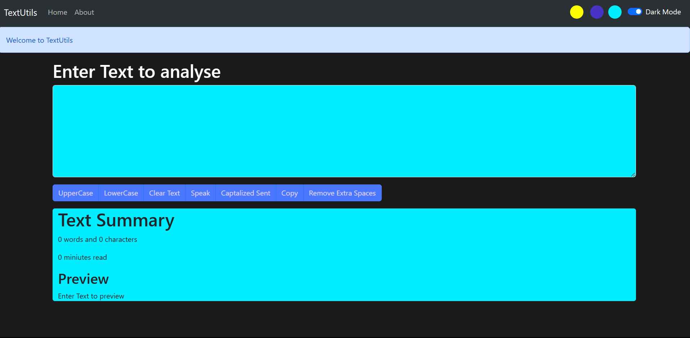

# TextUtils documentation

## Runing the project

* First Install NodeJS

    [Node JS Installation](https://nodejs.org/en/download)

* Run The Following Command in order

        npm install i

        npm start

## What is Textutils?

* Textutils is an web application which can be used to analyse text & to form some basic operations on it.

* Basic operations include uppercasing, lowercasing, copying, removing extra spaces, captilized the text properly & we can even make the website to speak the text.

## Dark mode in textutils

* You can even can the color of the container where you type the text.

## Future of Textutils

* As it is code with harry's project I enjoyed the operations on text we can make it more like quillbot & let people enjoy the good stuff for free.
